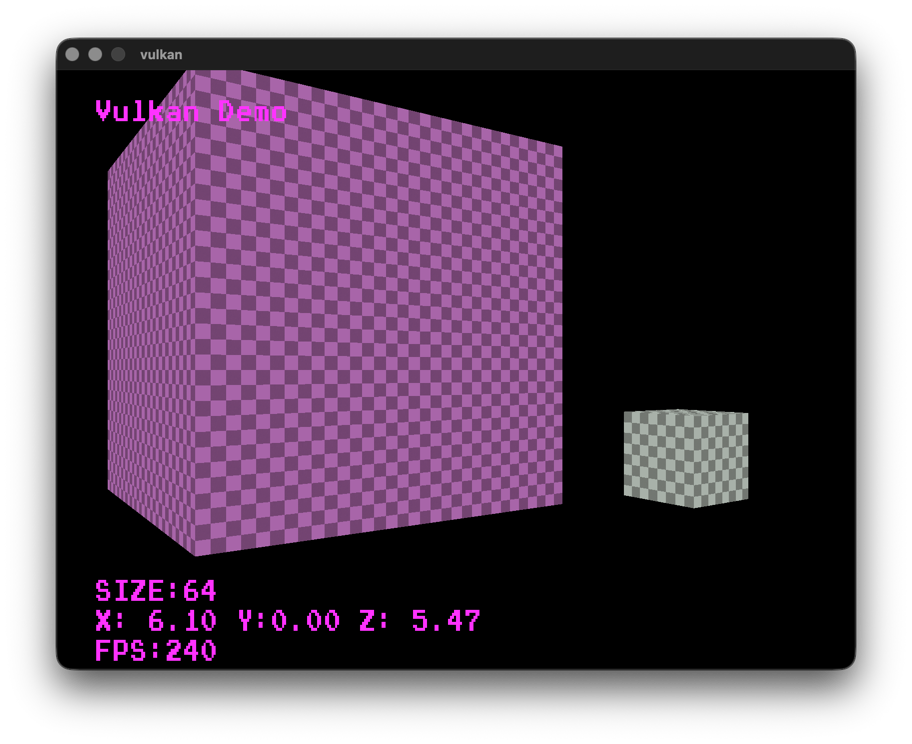

#### VULKAN HELL YEAH

#### THIS IS IT:

#### TL:DR
you run it with make lol. Good luck
compile shader with cd shad and then make NAME=(name of shader -> triangle.vert --> NAME=triangle)
- idk if it even runs on your machine 
- this was scary to get even working
