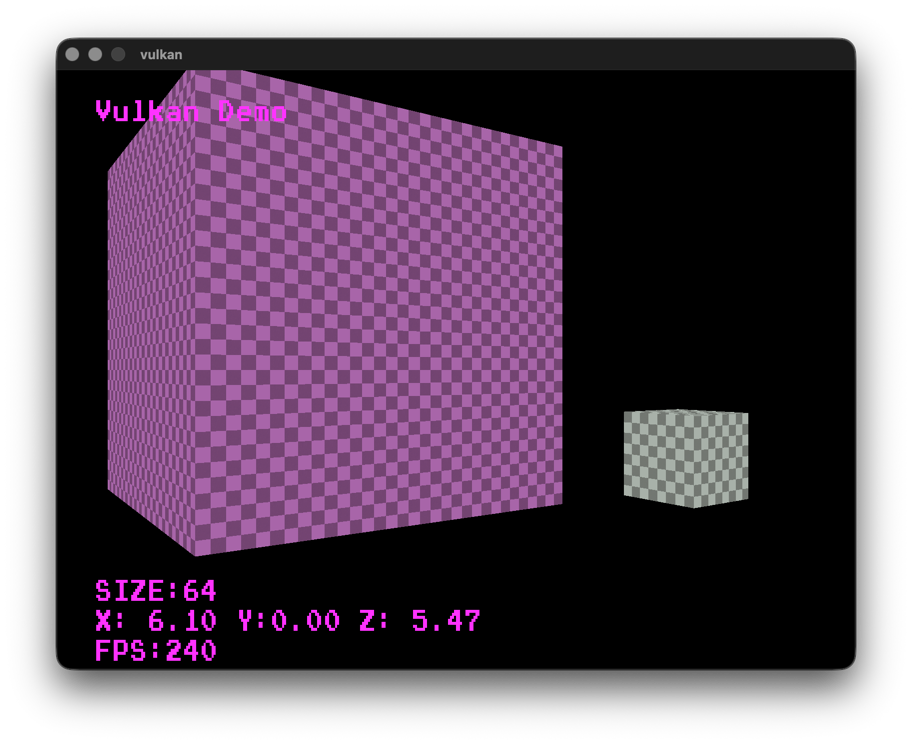

#### VULKAN HELL YEAH

#### THIS IS IT:

#### TL:DR
you run it with make lol. Good luck
compile shader with `make shaders` (requires `glslangValidator`).
- idk if it even runs on your machine 
- this was scary to get even working

#### Setup
1. Install the Vulkan SDK for your platform (macOS users should install the SDK with MoltenVK).
2. Pull vendored deps:
   `git submodule update --init --recursive`
3. Build and run:
   `make`

If your Vulkan SDK is not auto-detected by CMake, export `VULKAN_SDK` before running `make`.
